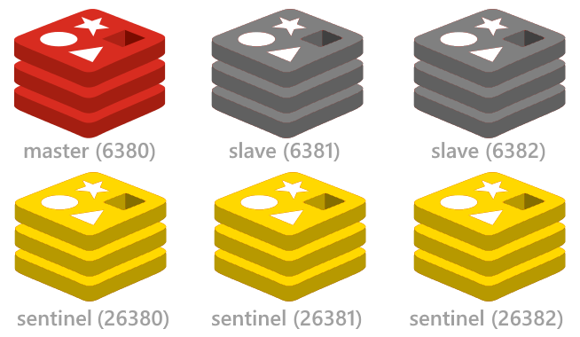

# Redis Sentinel Kubernetes

Sentinel is agent fetchs the state of the redis masters and slave nodes. If any master faliure event occured, couple of sentinel agents decide to the new master from group of slaves . 

Sentinel agent has a logic name of cluster and quorum count for make decision .Quorum is  count of which agents has a reliable vote for leader election .

## DIAGRAM
Implementation of that stack, on traditional architecture you must manage the health checkt for service discovery and general suggestion is ha-proxy. 

This controller is fetching states from sentinel and update the label of redis-master service when master is changed .




## Deployment 

* Sentinel Deployment 

You can update sentinel config from configmap of helm chart .

```
helm install --name redis-ha --namespace default --set environment=production .
```

* Controller Deployment

```
docker build -t repo/controller:latest . 
```
After than you deploy your controller , you can change variables from env vars of deployment